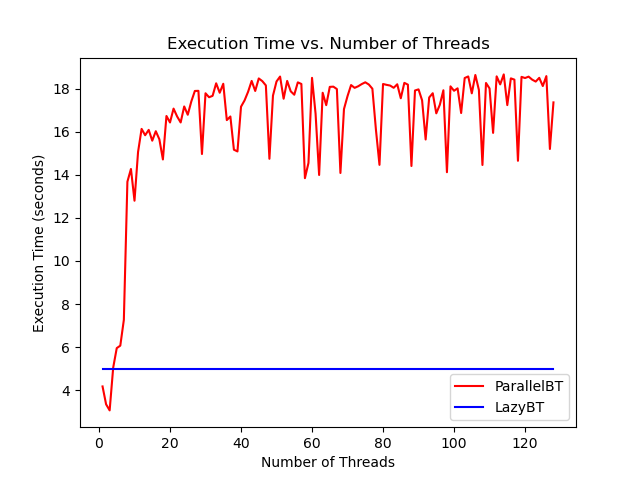

# 1. Output (Answer to the Questions)
## 1.1 LazyBT
- [source file](./src/LazyBT.c)
### 1.1.1 After Insert
<br/><br/>

### 1.1.2 After Delete
<br/><br/>

### 1.1.3 look_up result
```log
1
0
0
1
1
1
```


## 1.2 ParallelBT
- Since this part needs a normal BST first, so here're two source files.
  - [serial version source file](./src/NormalBT.c)
  - [parallel version source file](./src/ParallelBT.c)
### 1.2.1 After Insert
<br/><br/>

### 1.2.2 After Delete
<br/><br/>

### 1.2.3 look_up
```log
1
0
0
1
1
0
```

## 1.3 Performance
### 1.3.1 show the figure
<br/><br/>

- See the whole `Section 3. Use my script` of [README](./README.md) about how I get this figure.

### 1.3.2 a countercase
- Just insert `1 2 3, ..., 3000000` in order, this will destroy the normal BST (without rotating or reconstruction) with any lock method or thread scheduling.

# 2. (some but not all) Implementation Details
## 2.1 Data Generator
- My data generator is a little different from the data generator shown in the homework handout pdf. Actually I beleive it's stronger.
- It can provide `Insert-Delete-Insert`(e.g. Insert 1/.../Delete 1/.../Insert 1/.../look up 1/...) sequence (but this hw ensures every insert unique), while maintaining similar randomness (actually, you can control the ratio of 3 different operations by modifying my code).
- It needs the parameter input to tell `how many operations` and `the range of value in tree`.
- See more details in `src/data_gen.c`.

## 2.2 Slightly different in LazyBT
### 2.2.1 My definition for unbalance
- See L121~L129 [here](./src/LazyBT.c)
### 2.2.2 Reconstruct Condition
- I unified the reconstruct condition between Insert and Delete operation. See L41~L62 [here](./src/LazyBT.c)

## 2.3 Parallel implementation
- see the comments [here](./src/ParallelBT.c)
- performance should thank to the randomness of the data generating