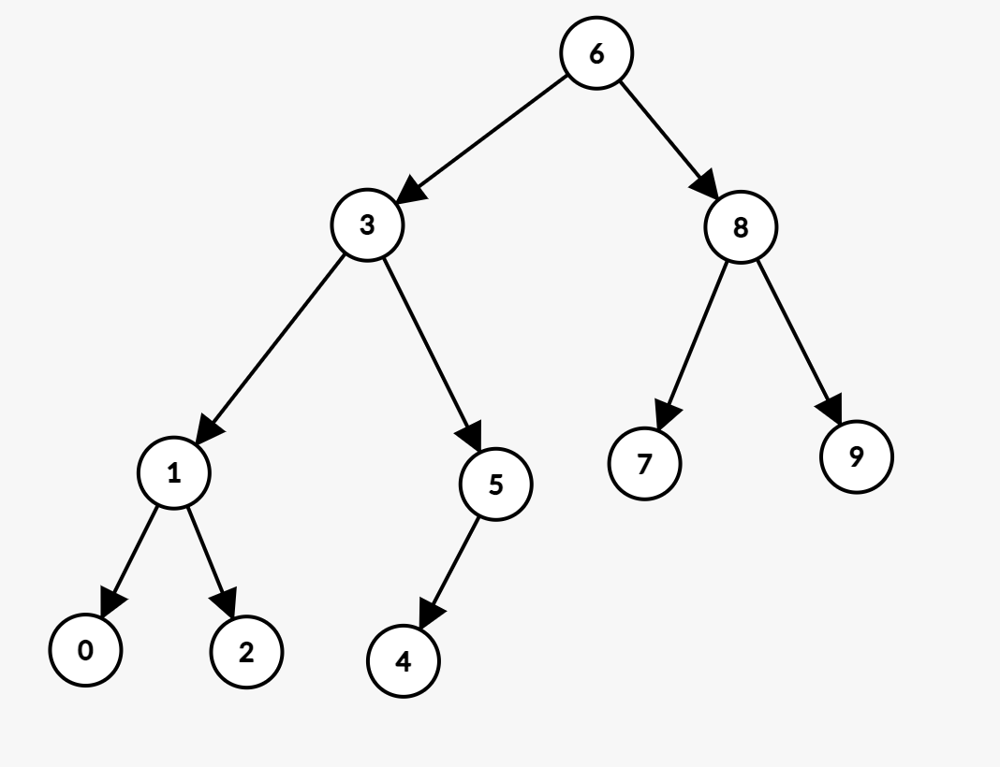
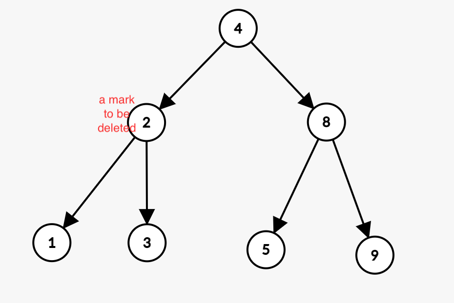
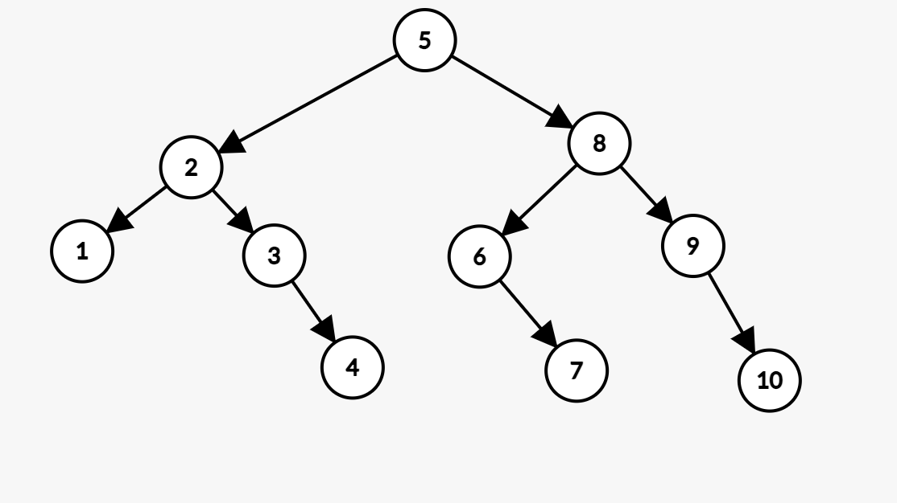

# 1. Output (Answer to the Questions)
## 1.1 LazyBT
### 1.1.1 After Insert
<br/><br/>

### 1.1.2 After Delete
<br/><br/>

### 1.1.3 look_up result
```log
1
0
0
1
1
1
```


## 1.2 ParallelBT
### 1.2.1 After Insert
<br/><br/>

### 1.2.2 After Delete
<br/><br/>

### 1.2.3 look_up
```log
1
0
0
1
1
0
```

## 1.3 Performance
